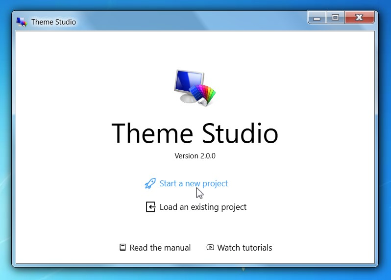
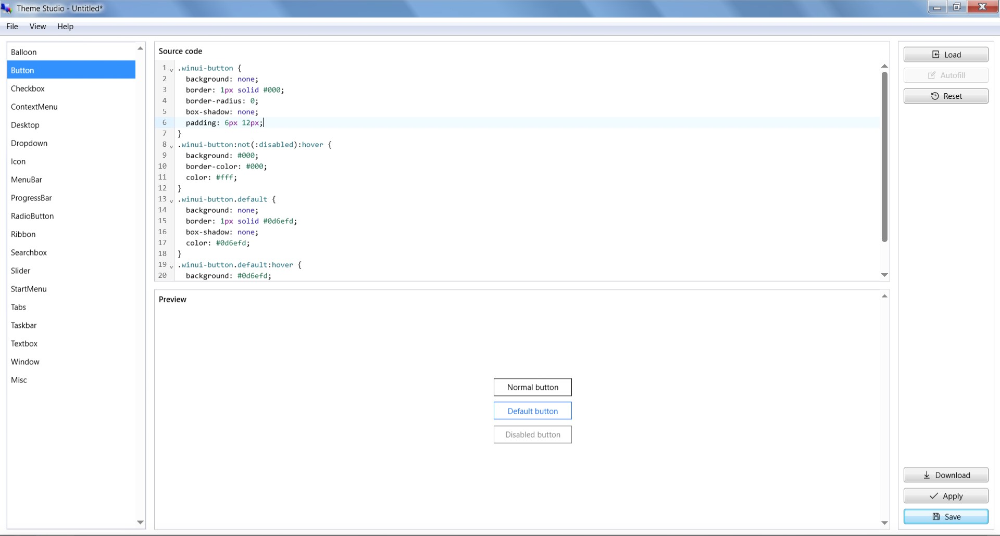
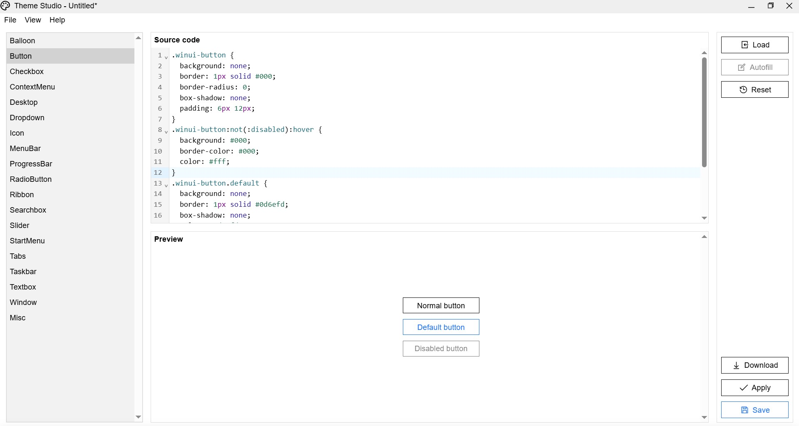
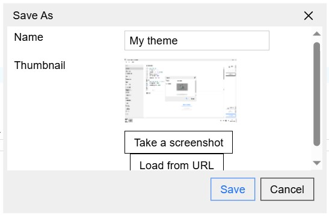
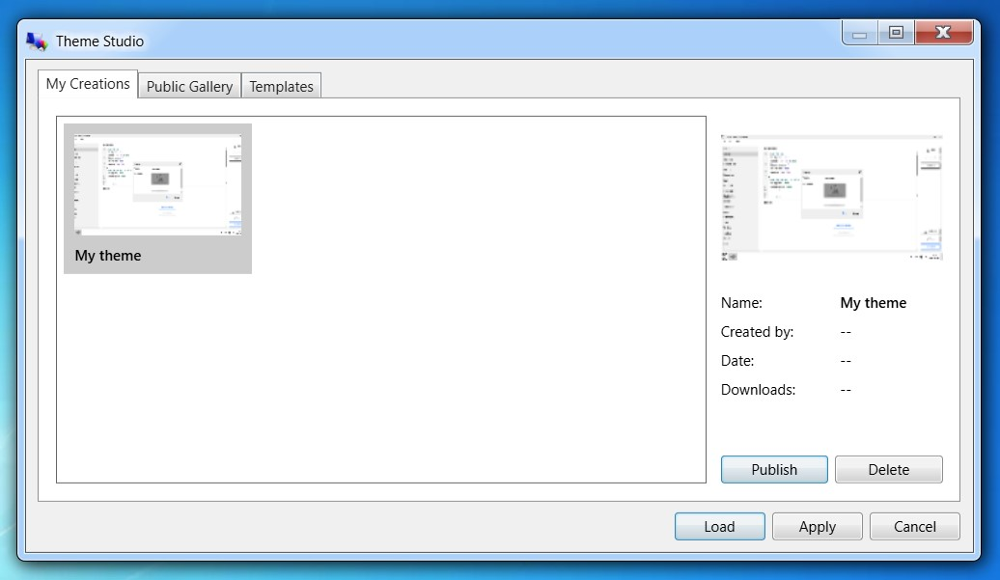
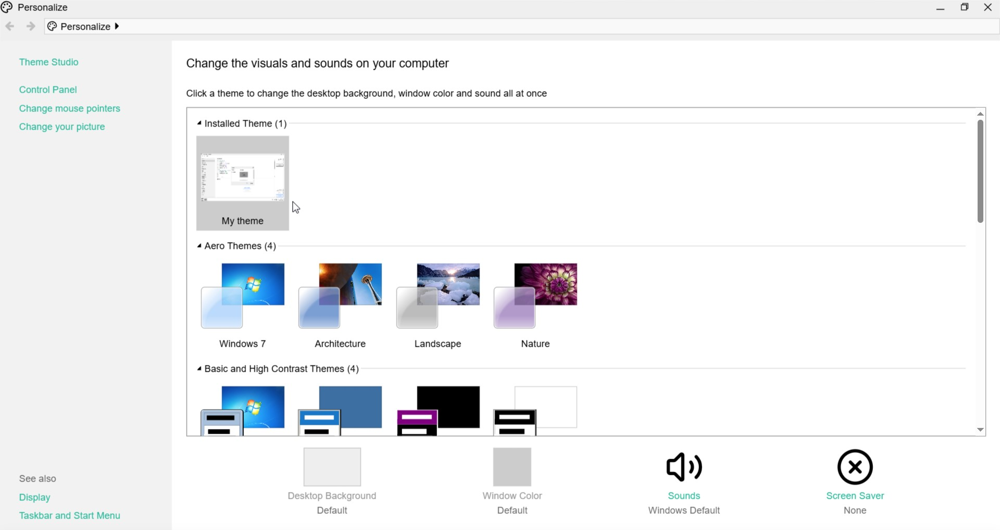

# In-depth guide

This page aims to walk you through __Theme Studio__ in an in-depth manner, everything you need to know to craft your own themes for Win7 Simu. As a prerequisite, it is required that you have some ground knowledge of __HTML__ and __CSS__ to be able to follow along easier, otherwise, here are some good free resources to learn:

* MDN ([HTML](https://developer.mozilla.org/en-US/docs/Learn/HTML) - [CSS](https://developer.mozilla.org/en-US/docs/Learn/CSS))
* w3schools ([HTML](https://www.w3schools.com/html/default.asp) - [CSS](https://www.w3schools.com/css/default.asp))
* Sololearn ([HTML](https://www.sololearn.com/learn/courses/html-introduction) - [CSS](https://www.sololearn.com/learn/courses/css-introduction))

## Step-by-step

### Writing your first theme

* From the main window, choose "Start a new project". A blank Theme Studio editor will open up for you.



* Let's say I want to make a theme that only changes the appearance of the buttons, I will select the "Button" element from the Elements navigation pane on the left.
* In the Source code editor, enter:

```css
.winui-button {
  background: none;
  border: 1px solid #000;
  border-radius: 0;
  box-shadow: none;
  padding: 6px 12px;
}
.winui-button:not(:disabled):hover {
  background: #000;
  border-color: #000;
  color: #fff;
}
.winui-button.default {
  background: none;
  border: 1px solid #0d6efd;
  box-shadow: none;
  color: #0d6efd;
}
.winui-button.default:hover {
  background: #0d6efd;
  border-color: #0d6efd;
}
```

* The button's CSS snippet above will take effect immediately in the Preview and you should be able to see a new appearance of the buttons:



* To temporarily experience the theme in action, click the "Apply" button. You should see the new appearance of the buttons everywhere.



* Here we have a few things to note:
  * You will notice that the UI is changed to a completely "unstyled" look, this is because Theme Studio will apply only the styles that you have defined in your project on top of a bare minimum __base__ theme. This allows you to have a clean slate to work with, without having to override the complex styles of the system themes.
  * The applied theme will only last for the current login session, if you logout or restart the simulator, the changes will be gone, so make sure to save your theme before exiting Theme Studio.
* Once happy with it, you can save the theme by clicking the "Save" button. From the save popup, enter a desired Name, for the thumbnail (this is optional), there are 2 options available:
  * Take a screenshot - this will quickly capture a screenshot of your current screen.
  * Load from URL - this will load the image from the input URL.



* Clicking "Save" again will save the theme locally on your device.

### Using themes

* After your theme is saved, you can find it under the "My Creations" tab of Theme Studio's explorer.



* To use your created theme, select "Apply". You should now see the buttons' appearance changed to the selected theme.
  * This change will last for as long as you decide to switch to another theme.
* If you open up "Personalize", you will also notice that there is a new section for the selected theme as "Installed Theme", allowing you to switch between this and the system themes.



* This also applies to any public themes and templates that you use from Theme Studio.

<SponsorAd />

### Publishing your theme

:::warning Note
This feature is only available with user accounts. Therefore, make sure you are logged-in in order to see it.
:::

* If you want to share your theme with the community, you can publish it also by selecting the theme, and clicking "Publish" from the Theme Studio's explorer.


* The theme will then be published under the "Public Gallery" tab.
* As your theme is now publicly available, everyone has access to it. They can either load its source code to view and modify, or use it to apply to their Win7 Simu.
* Likewise, you can also view, modify, or use any of the public themes.
* If you wish to remove your theme from the public, simply select "Delete" from the Theme Properties pane, your theme will be then removed from the Public Gallery. However, keep in mind that anyone who has already loaded your theme onto their device will still keep a copy of it.

## What's next?

Now that you have a deeper understanding of how to use Theme Studio, you can start exploring more about the various [selectors](./selectors.md) available in Win7 Simu system to customize your themes even further and make stunning themes!
