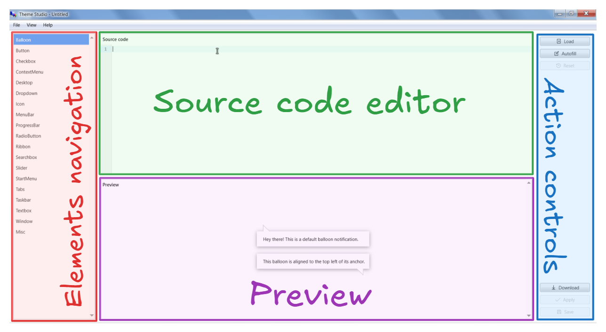
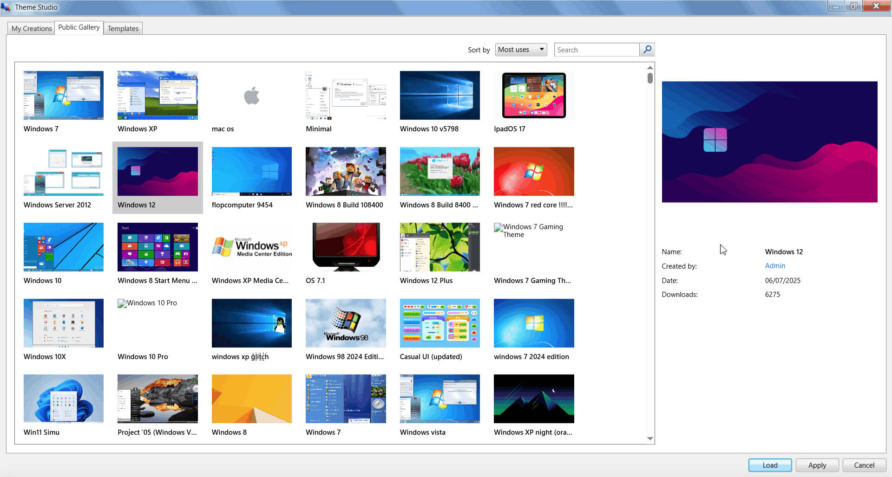
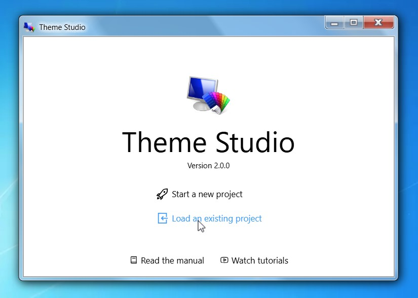
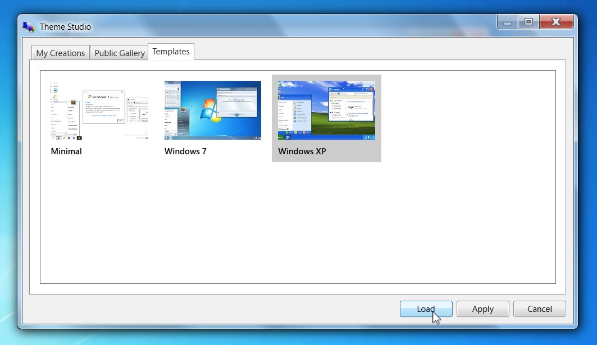
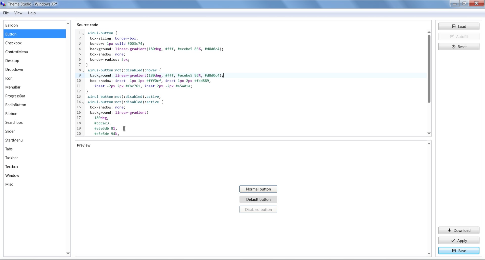
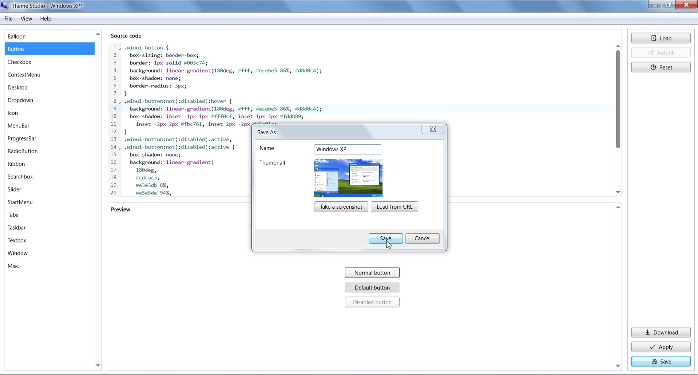

# Getting started

## User interface

### The Editor

The Theme Studio's editor interface is designed to be simple and easy to use, with 4 apparent regions:

* Elements navigation - the navigation panel of available elements to style.
* Source code editor - where you write your CSS code to style the selected element.
* Preview - shows a live preview of the selected element with the applied styles.
* Action controls - to perform actions on the current project/theme, such as Load, Save, Apply, etc.

:::tip Miscellaneous element
The "Misc." element is a special element that doesn't have the Preview area. It is intended to support any other elements that are not shown on the Elements navigation, therefore you can use it to write any miscellaneous CSS here.
:::

### The Explorer

The Theme Studio's explorer consists of 3 tabs:

* My Creations - where you can manage your saved projects/themes on your device, you can Load, Apply, or Publish them from here.
* Public Gallery - where you can find all sorts of themes published by the community, you can also load their source code to your editor or apply to your Win7 Simu.
* Templates - some available templates as base themes that you may select and get started easily.

On the right side, a Theme Properties pane is shown when selecting a theme, allowing you to see more details about the theme, as well as perform actions such as Publish or Delete (if applicable).

## Quick start

The quickest and easiest way to get started is to load the source code from an existing template:

1. From the main window, choose "Load an existing project"
  
1. Switch to the "Templates" tab, select a template, and choose "Load".
  
1. You should now be able to see the source code of your selected template, then you can start making changes using the editor to craft your own theme based on it.
  
1. Finally, you can save your project as a theme by entering the required information in the save popup. You can then resume editing from the current progress, or apply the theme to your Win7 Simu.
  

## What's next?

Now that you have a basic understanding of Theme Studio's interface and how things work, you can proceed to the [in-depth guide](./in-depth-guide.md) to learn more about creating themes, using themes, and publishing your themes to the community!
