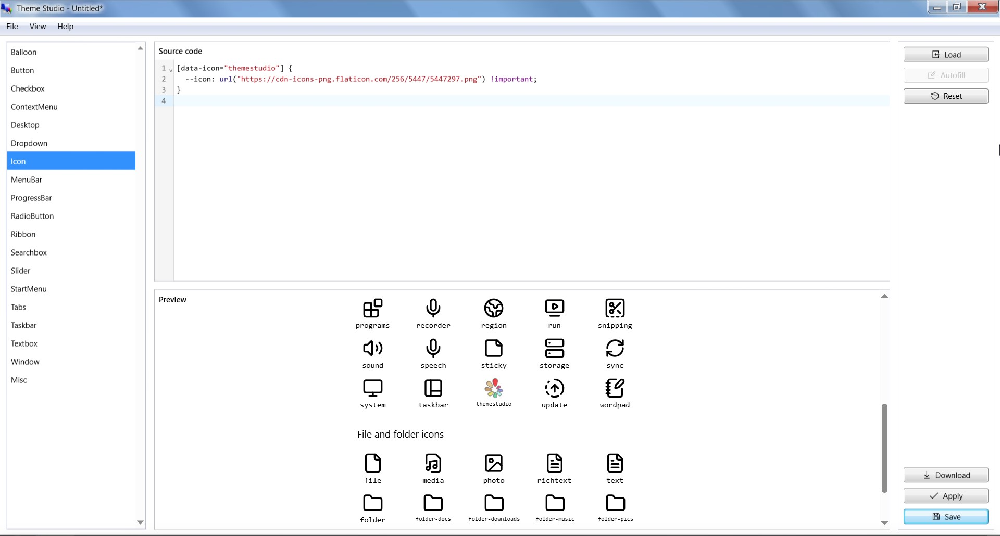

# Selectors

__Selectors__, in the context of Theme Studio, are special patterns used to target specific UI elements or components for styling purposes. They allow us to define how certain parts of the UI should look based on their attributes, states, or hierarchy within the application.

For example, if we want to change the appearance of buttons, Theme Studio provides selectors that can target all button elements or specific states of buttons (like hover or disabled).

## The Autofill feature

Most of the time, you won't need to remember and manually write selectors since Theme Studio includes an "Autofill" feature. This feature automatically fills the editor with the appropriate selectors for all available UI elements that can be styled. This makes it easier for you to customize themes without needing to understand the intricacies of selector syntax, especially for complex UI components like the ribbon, window, taskbar, or start menu. The video below demonstrates how the Autofill feature works in Theme Studio:

@[youtube](https://youtu.be/MLmq3wo4AZ8)

## In-depth understanding

While the Autofill feature simplifies the process and works well for most users, having a deeper understanding of selectors can be beneficial for advanced customization. Knowing the philosophy behind selectors and how they function helps you create more tailored and stunning themes by allowing you to modify certain aspects of the UI that may not be covered by the Autofill feature, or to troubleshoot any issues that arise during the theming process.

### Basic elements

Basic elements include simple and commonly used UI building blocks such as buttons, dropdowns, text fields, icons etc. They are the foundational components that make up the user interface. All basic elements follow a straightforward selector syntax, starting with the prefix `winui-` followed by the element's name. For example:

```css
.winui-button {
    /* Your button styles */
}
.winui-dropdown {
    /* Your dropdown styles */
}
.winui-textbox {
    /* Your textbox styles */
}
```

#### Checkboxes and radio buttons

These elements have a slightly complex structure due to their unique nature. The selector syntax for these elements includes additional labels with pseudo-classes to target their specific parts. For example:

```css
.winui-checkbox label::before {
    /* The outer box styles */
}
.winui-checkbox label::after {
    /* The inner checkmark styles */
}
.winui-radio label::before {
    /* The outer circle styles */
}
.winui-radio label::after {
    /* The inner dot styles */
}
```

#### Icons

Changing icons is well supported in Theme Studio. The selector syntax for icons typically involves targeting type-specific data attributes, and you can easily replace default icons with custom ones using the `--icon` CSS variable. For example:

```css
[data-icon="paint"] {
    --icon: url("custom-paint-icon-url") !important;
}
[data-icon="themestudio"] {
    --icon: url("custom-themestudio-icon-url") !important;
}
```

Note that `!important` is mandatory to ensure that your custom icon takes precedence over the default one.



_Example of changing the Theme Studio icon in Theme Studio._

### Complex components

Complex components refer to more intricate UI components that consist of multiple sub-elements or have advanced functionality. These components often require more detailed selectors to target specific parts or states effectively. Examples of complex components include the ribbon, window, taskbar, and start menu.

Complex components follow a standardized selector syntax that typically starts with a prefix indicating the component type, followed by double underscores (`__`) to denote parts or sections within the component, and sometimes additional hyphens (`-`) to specify sub-parts. For example, the window component comprises several parts and sub-parts, each with its own selector:

```css
.window__main {
    /* The window container styles */
}
.window__titlebar {
    /* The window's title bar styles */
}
.window__control-list {
    /* The window's control list styles */
}
.window__control-item {
    /* The window's individual control item styles */
}
.window__body {
    /* The window's body styles */
}
.window__statusbar {
    /* The window's status bar styles */
}
.window__footer {
    /* The window's footer styles */
}
```

:::tip A general syntax breakdown for complex components is as follows:

```jsx
<component>__<part>-<subpart>
```

:::

### Handling states

Either for basic elements or complex components, selectors can also include states to target specific conditions or styles. __States__ refer to different visual or functional conditions of an element, such as hover, active, disabled, focused etc. To target these states, we use either pseudo-classes that CSS supports or a special class prefix `is-` or `has-` for certain states. For example:

```css
.winui-button:hover {
    /* Styles when the button is hovered */
}
.winui-button:active {
    /* Styles when the button is pressed */
}
.winui-button:disabled {
    /* Styles when the button is disabled */
}
.ribbon__tab-item.is-selected {
    /* Styles when the ribbon tab is selected */
}
.taskbar__main-item.is-opened {
    /* Styles when the taskbar item is opened */
}
.window__control-item.is-maximize {
    /* Styles for the window maximize control button */
}
```

:::danger Important note
Avoid id selectors (e.g., `#taskbar`, `#start-button`) as they are proven to be unstable and likely to interfere with feature development of Win7 Simu in the future. They are deprecated and will be removed completely from the app moving forward.
:::

## Changes in v2

In Theme Studio v2, there have been thoughtful considerations regarding selectors to enhance usability and maintainability. The Autofill feature has been introduced to simplify the theming process, allowing users to easily apply styles without needing to memorize complex selector syntax. Additionally, the selector syntax has been standardized for both [basic elements](#basic-elements) and [complex components](#complex-components), making it more intuitive for users to understand and apply styles effectively.

Below is a summary of breaking changes in selectors from v1 to v2:

| Element/Component | v1 syntax | v2 syntax | Note
| --- | --- | --- | ---
| Desktop background | `#windows` | `.desktop-background.is-main` | Changed to class-based selector, avoiding conflicts with other features
| Start button | `#start-button` | `.startbutton-wrapper` | Changed to class-based selector
| Taskbar | `#taskbar` | `.taskbar__wrapper` | Changed to class-based selector
| Taskbar items region | `#taskbar-items` | `.taskbar__main` | Changed to class-based selector
| Individual taskbar items | `#taskbar-items > .taskbar-item` | `.taskbar__main-item` | Changed to class-based selector, simplified structure
| Taskbar tray region | `#taskbar-tray` | `.taskbar__tray` | Changed to class-based selector
| Window container | `.window` | `.window__main` | Standardized structure
| Window's title bar | `.titlebar` | `.window__titlebar` | Standardized structure
| Window's control button | `.window .control` | `.window__control-item` | Standardized structure
| Window's body | `.window .container` | `.window__body` | Standardized structure
| Window's status bar | `.window .statusbar` | `.window__statusbar` | Standardized structure
